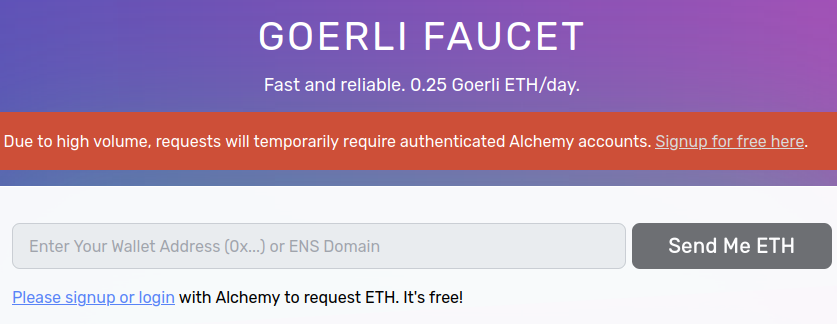
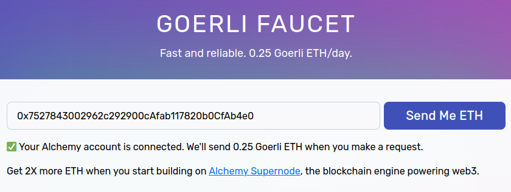
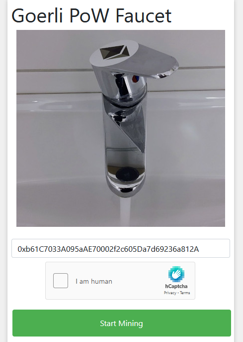
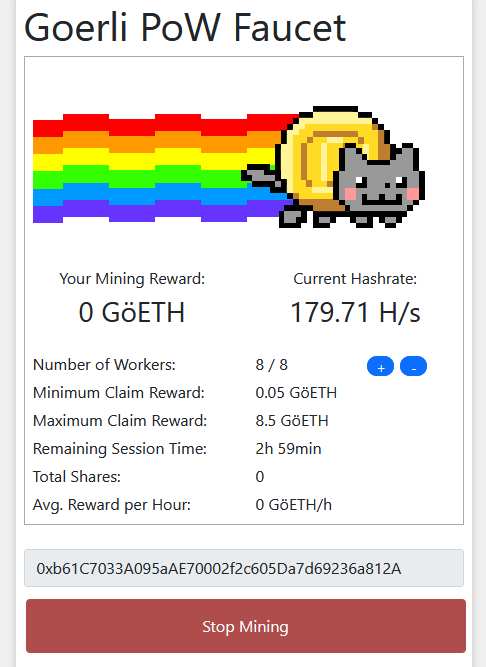
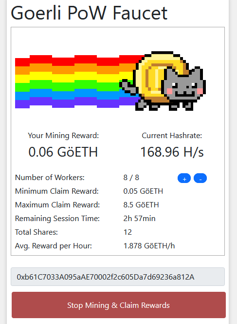

# Uso de faucet

Normalmente las monedas se adquieren a través de minería y comprándolas con efectivo. Sin embargo, como usaremos la testnet Goerli, podemos obtener monedas de forma totalmente gratuita a través de un **faucet**.

Los faucets nos regalan una pequeña cantidad de monedas, GoerliETH en nuestro caso. La mayoría tienen alguna restricción de tiempo para que un usuario malintencionado no pueda llevarse todas las monedas gratuitas.

!!! warning
    Recientemente algunas otras testnet como Ropsten y Rinkeby dejaron de funcionar, por la tanto la popularidad de Goerli aumentó. Actualmente son pocas las faucets que siguen funcionando debido a que muchas se han quedado sin reservas de ETH.

## Goerli Faucet

[Goerli Faucet](https://goerlifaucet.com/) nos permite pedir hasta 0.25 ETH cada día. Debido a la alta popularidad que Goerli ha tenido recientemente, este faucet requiere que creemos y nos identifiquemos con una cuenta de Alchemy. Al crearla, debemos elegir la opción gratuita.

<figure markdown>
  
  <figcaption>Se requiere una cuenta de Alchemy</figcaption>
</figure>

Una vez te hayas registrado e ingresado podrás colocar la dirección que Metamask te da y pedir tu ETH gratuito.

<figure markdown>
  
  <figcaption>Después de ingresar ya podemos pedir</figcaption>
</figure>

## Goerli PoW Faucet

[Goerli PoW Faucet](https://goerli-faucet.pk910.de/) es un faucet que requiere que realicemos minería a cambio de entregarnos ETH.

Debemos colocar nuestra dirección para recibir las monedas y luego hacer click en el botón de Start Mining.

<figure markdown>
  
  <figcaption>Previo a iniciar minería</figcaption>
</figure>

Al hacerlo nuestro navegador web empezará a calcular hashes, es decir, a realizar minería. Debemos esperar algunos minutos mientras se realiza el trabajo suficiente para obtener el pago mínimo.

<figure markdown>
  
  <figcaption>Se requiere un mínimo de 0.05 ETH para poder retirar</figcaption>
</figure>

Después de la espera, el botón de abajo cambiará y nos indicará que ya podemos cobrar lo obtenido.

<figure markdown>
  
  <figcaption>Al alcanzar el mínimo, ya podremos retirar</figcaption>
</figure>

Evita este faucet si estás trabajando en una laptop únicamente con batería, o si tu computadora no tiene muy buen enfriamiento. Realizar minería hace que la computadora realice bastante trabajo.