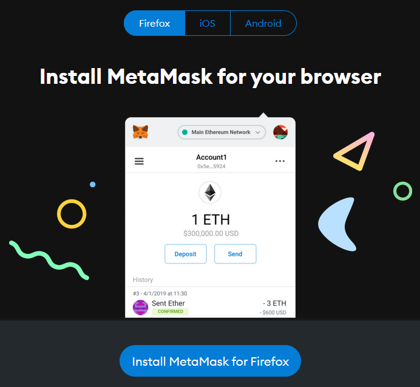
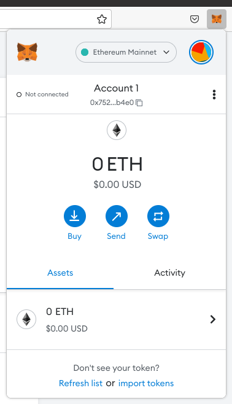
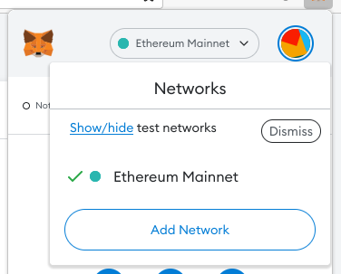
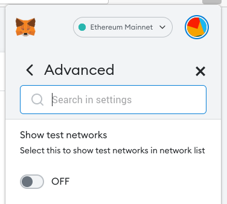
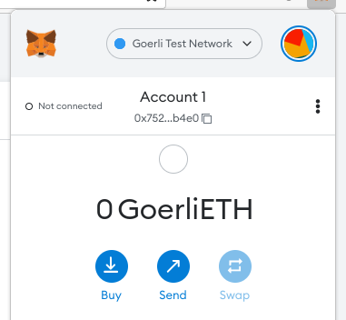

# Instalando una billetera

Una **billetera** es un programa, aplicación, o extensión del navegador que nos permite acceder a nuestras criptomonedas y realizar transacciones.

Durante el resto del curso utilizaremos una billetera llamada **Metamask**, la cuál se instala como una extensión en nuestro navegador Firefox, Chrome, o Brave. Utilizaremos **Ethereum** en la **testnet Goerli**.

Ethereum es un blockchain (con una moneda llamada **Ether (ETH)**) que nos permite programar y utilizar contratos inteligentes. La testnet Goerli nos permitirá realizar pruebas sin tener que gastar nada de dinero.

!!! warning "Usar Goerli es gratis"
    Para el curso no necesitaremos comprar nada de ETH real. Usaremos la testnet Goerli en la cuál podremos obtener ETH de forma gratuita.

## Instalación de Metamask

Ingresa a la página oficial de [descarga de Metamask](https://metamask.io/download/), elige tu navegador, y sigue las instrucciones para instalarla.

<figure markdown>
  
  <figcaption>Metamask funciona en varias plataformas</figcaption>
</figure>

Metamask es una extensión para el navegador, entonces durante el proceso de instalación serás redirigido a la tienda de Firefox, Chrome, o Brave respectivamente.

!!! warning "Revisa bien el sitio de instalación"
    Existen muchas páginas que ofrecen billeteras falsas, o que buscan imitar la de una billetera real. Asegurate de instalar desde una página confiable

    En Firefox los autores de la extensión son `danfinlay` y `kumavis`. En Chrome y Brave el autor de la extensión es `https://metamask.io`.
    
## Inicializando nuestra billetera

Tras instalar Metamask, podemos hacer click en su ícono y se abrirá una página para inicializar nuestra billetera.

Cuando llegues a la sección **New to Metamask?** elige la opción **Create a wallet**.

!!! warning "No reutilices tu frase semilla"
    Se recomienda fuertemente crear una billetera nueva para el curso, y no reutilizar alguna otra que ya tengas para uso personal, en especial si esta ya tiene criptomonedas.

Metamask pedirá que creemos una contraseña, la cuál es solo para uso local. A continuación nos mostrará un video y algunos consejos de seguridad sobre como proteger nuestra **frase semilla**. Pon atención a estos consejos antes de continuar. La pantalla siguiente nos mostrará nuestra frase, que debemos guardar de forma segura.

!!! danger "Nunca compartas tu frase semilla"
    Si alguien llega a tener acceso a nuestra frase semilla, tendrá acceso a todo lo que tengamos guardado en esa billetera. No compartas esa información con nadie. Guarda tu frase semilla solamente en papel u otro medio no digital, y en un lugar seguro.

La siguiente pantalla consiste en ingresar nuestra frase, para comprobar que la anotamos correctamente. Esto es necesario porque si perdemos la frase, perdemos el contenido de la billetera de forma permanente.

Al pasar esta pantalla, Metamask nos indicará que completamos el proceso, ahora ya podemos usar nuestra billetera.

## Utilizando la testnet Goerli

Al hacer click en el ícono de Metamask se desplegará una pequeña ventana flotante que muestra cuánto ETH tenemos disponible.

<figure markdown>
  
  <figcaption>Billetera Metamask</figcaption>
</figure>

En la parte de arriba hacemos click en **Show/hide test networks** lo cuál nos llevará hacia el menú de configuraciones donde podemos habilitar esta funcionalidad.

<figure markdown>
  
  <figcaption>Show/hide test networks</figcaption>
</figure>
<figure markdown>
  
  <figcaption>Habilitar funcionalidad aquí</figcaption>
</figure>

Tras habilitarla, podemos elegir **Goerli Test Network** en el menú desplegable que Metamask tiene arriba. Luego de hacerlo notaremos que el valor mostrado cambió de 0 ETH a **0 GoerliETH**.

<figure markdown>
  
  <figcaption>GoerliETH</figcaption>
</figure>
