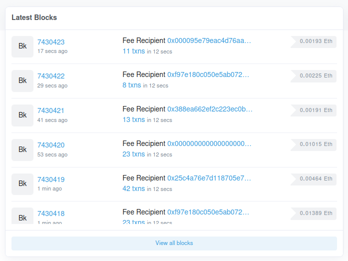
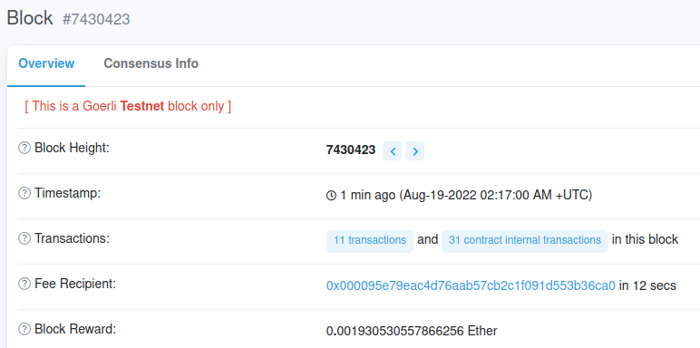
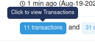
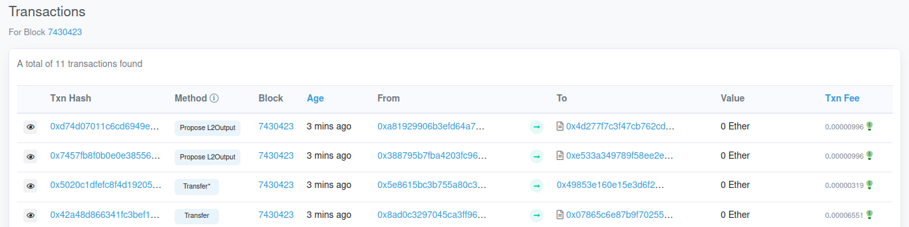
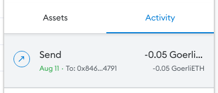
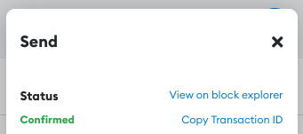
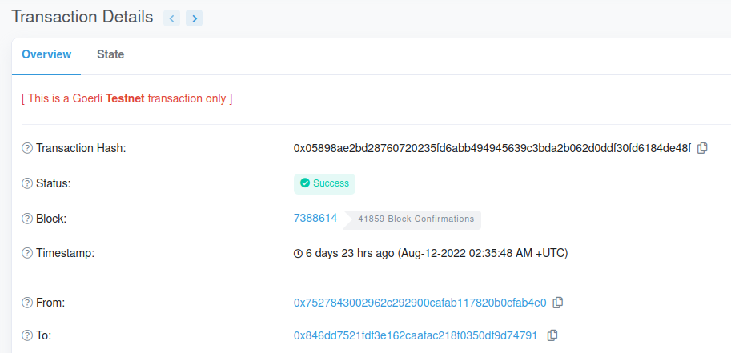
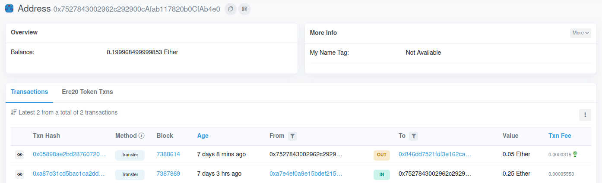

# Explorando el blockchain

Todas las transacciones realizadas quedan registradas en el blockchain. Podemos explorar este desde nuestro navegador usando sitios como [Etherscan](https://goerli.etherscan.io). Recuerda que estamos trabajando en la testnet Goerli, entonces asegurate de ingresar a la página correcta, de lo contrario verás transacciones de la red principal.

## Bloques

Entra a [Etherscan](https://goerli.etherscan.io) y en el lado izquierdo haz click sobre un bloque.

<figure markdown>
  
  <figcaption>Bloques recientes en Etherscan</figcaption>
</figure>

Tras seleccionar un bloque, podrás ver bastante información sobre este. Algunos de los datos más importantes son:

* **Transactions:** Cantidad de transacciones incluídas como parte de este bloque.
* **Block reward** y **fee recipient:** Cuál fue la recompensa por operar este bloque y a quién fue pagada.
* **Gas used:** Gas consumido. Este es pagado por quien realizo la transacción y es entregado como recompensa del bloque.
* **Burnt fees:** Cuánto ETH fue **quemado**, es decir, dejó de existir permanentemente.
* **Parent hash:** Hash del bloque anterior para garantizar integridad de la cadena.

<figure markdown>
  
  <figcaption>Información del bloque</figcaption>
</figure>

Puedes hacer click sobre la cantidad de transacciones para ver un listado de estas.

<figure markdown>
  
  <figcaption>Ver lista de transacciones del bloque</figcaption>
</figure>

<figure markdown>
  
  <figcaption>Lista de transacciones</figcaption>
</figure>

!!! question "Experimenta"
    Explora un bloque de la [red principal](https://etherscan.io). Compara los valores como **block reward**, **gas used** y **burnt fees**.

    Como la red principal tiene una demanda mucho mayor, los precios son más altos.

## Transacciones

Haz click en el botón de Metamask y en la parte de abajo has click en la transacción realizada en el ejercicio pasado.

<figure markdown>
  
  <figcaption>Transacción que realizamos previamente</figcaption>
</figure>

Luego haz click en **view on block explorer** para ver tu transacción en Etherscan.

<figure markdown>
  
  <figcaption>Enlace hacia el explorador de bloques</figcaption>
</figure>

Podrás ver muchos detalles sobre la transacción. Algunos de los más importantes son:

* **From** y **to:** Direcciones de quien envía y quien recibe el ETH.
* **Value** y **transaction fee:** Cantidad de ETH enviada y cuánto se pagó como costo de la transacción.
* **Gas price** y **gas fees:** Precios de cada unidad de gas al momento de realizada la transacción.
* **Gas limit:** Cuántas unidades de gas se consumieron. Una transacción para enviar ETH consume 21000 unidades.

<figure markdown>
  
  <figcaption>Detalles de la transacción</figcaption>
</figure>

!!! question "Experimenta"
    Ve a la red principal en Etherscan y explora alguna transacción de tipo **transfer**. Compara los valores de **gas price**, **gas fees** y **gas limit**.

    Una transferencia cuesta 21000 unidades de gas sin importar qué red sea.

!!! question "Experimenta"
    Busca varias transacciones cuyo tipo no sea **transfer** y observa cuáanto es su **gas limit**.

    Distintas operaciones tienen costos distintos.

## Direcciones

Abre Metamask y copia la dirección de tu billetera. Ingresa esta dirección en el buscador de Etherscan. Aquí podrás ver tu balance y transacciones realizadas.

<figure markdown>
  
  <figcaption>Transacciones entrantes y salientes de mi dirección</figcaption>
</figure>

Es posible seguir un camino entre direcciones y transacciones para saber cómo se están moviendo ciertos fondos.

!!! question "Experimenta"
    Podemos explorar las [direcciones con más ETH](https://etherscan.io/accounts) en la red principal. La mayoría de estas están identificadas y pertenecen a algún exchange. Haz click en alguna y observa la gran cantidad de transacciones que cada una realiza.