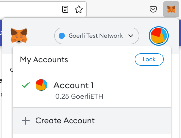
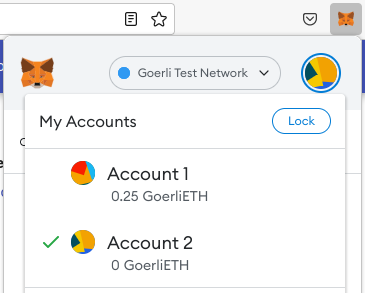
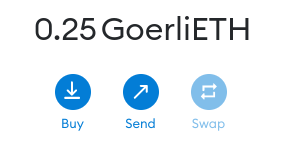
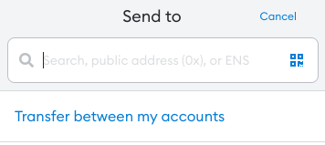
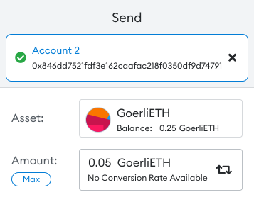
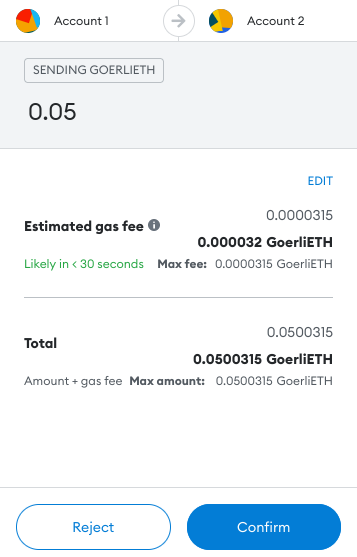
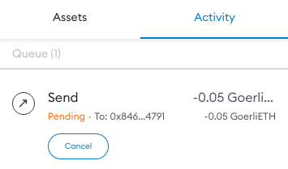

# Realizando una tranferencia

La operación más básica que podemos realizar con nuestras monedas es una transferencia. Nuestra billetera nos permitirá acceder a nuestras monedas, llevar control de múltiples cuentas, realizar transferencias, y autorizar transacciones.

## Creando direcciones adicionales

Para crear una nueva dirección abrimos la ventana de Metamask y luego hacemos click en el ícono circular que hay en la esquina superior derecha. Al hacerla se desplegará un menú donde podemos seleccionar **Create account**. Podemos colocarle un nombre a esta nueva cuenta, o dejar el nombre por defecto.

<figure markdown>
  
  <figcaption>Creando una nueva cuenta</figcaption>
</figure>

Después de crearla, al volver a hacer click en el ícono ahora las veremos las distintas cuentas y podremos elegir la que querramos usar.

<figure markdown>
  
  <figcaption>Listado con las cuentas creadas</figcaption>
</figure>

## Realizando una transferencia entre cuentas

Selecciona la cuenta que creaste en el inciso anterior y anota su dirección.

!!! info "Es seguro compartir tu dirección"
    Tu dirección puedes copiarla, anotarla, e incluso compartirla. No es posible que alguien tome control de tu cuenta solamente conociento tu dirección.

Luego de anotar la dirección, cambia de cuenta y elige la primera en donde has recibido algunas monedas desde los faucets. Cuando estes en tu cuenta correcta, haz click en el botón **Send** que aparece en el centro de la ventana de Metamask.

<figure markdown>
  
  <figcaption>Botón para enviar debajo de la cantidad disponible</figcaption>
</figure>

La ventana cambiará y ahora tenemos tres opciones.

* Pegar la dirección que copiamos.
* Hacer click en el ícono de la derecha para usar nuestra cámara para escanear un código QR que represente a una dirección.
* Usar la opción **Transfer between my accounts** para simplificar la selección de direcciones.

Usaremos la primera opción pues es el caso más general, con este podremos también enviar monedas a cualquier otro usuario.s

<figure markdown>
  
  <figcaption>Colocar la dirección a donde enviaremos</figcaption>
</figure>

Después de colocar la dirección, la siguiente pantalla nos permite elegir cuánto enviar. Colocaremos una pequeña cantidad y continuaremos.

<figure markdown>
  
  <figcaption>Elegir la cantidad a enviar</figcaption>
</figure>

El paso final nos pide confirmar la cantidad de **gas** antes de enviar la transacción. El gas es un tema avanzado que revisaremos en la seman final, de momento dejaremos la cantidad de gas por defecto.

<figure markdown>
  
  <figcaption>Previsualización del gas que se consumirá</figcaption>
</figure>

Luego de hacer click en **Confirm**, Metamask nos regresará a la ventana inicial donde podremos ver nuestra transacción pendiente. Pasará entre 10 segundos (el tiempo mínimo, que corresponde al tiempo de un bloque de Ethereum) y varios minutos antes que nuestra transacción se complete, esto depende de la congestión de la red en ese momento.

<figure markdown>
  
  <figcaption>La transacción se muestra como pendiente por un breve momento</figcaption>
</figure>

Dependiendo la configuración de nuestra navegador, es posible que Metamask nos muestre una ventana de notificación cuando la transacción se complete.