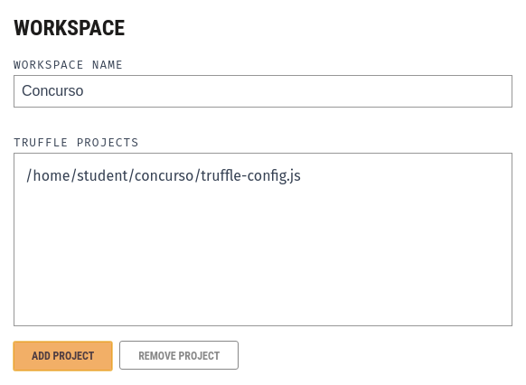
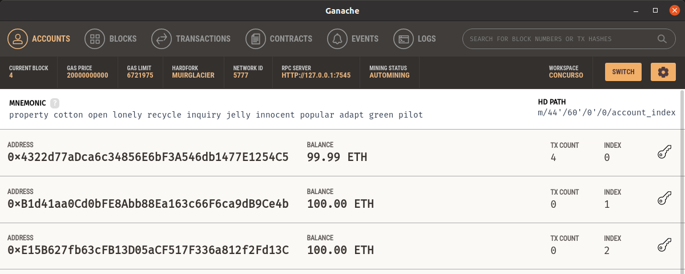
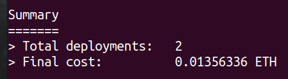
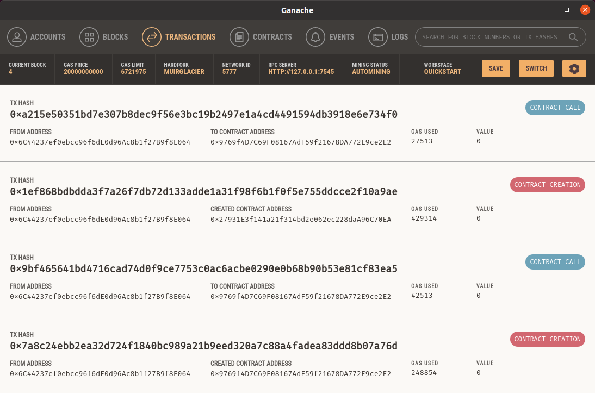
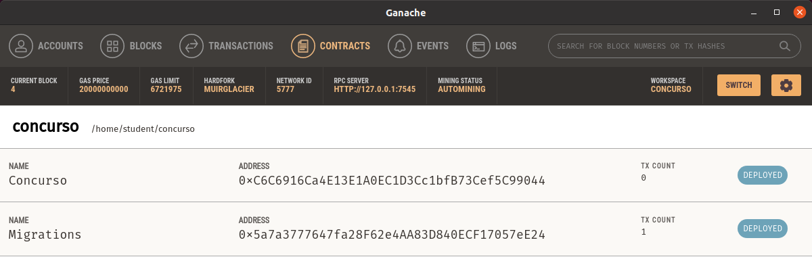
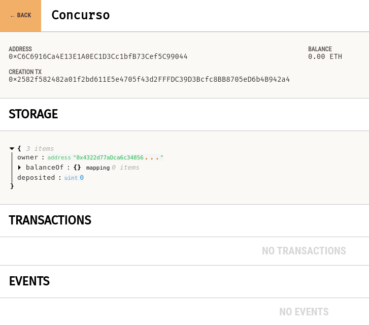

# Desplegando contratos en Ganache

Crearemos nuestro primer contrato inteligente y lo probaremos de forma local utilizando Ganache. También usaremos Truffle como soporte para desplegar el contrato.

## Iniciando un proyecto de Truffle

Cremos una carpeta nueva y entramos a esta.
```
mkdir concurso
cd concurso
```

Inicializamos el proyecto de Truffle dentro de la carpeta.
```
truffle init
```

Y al hacerlo se crearan las siguientes carpetas:

* **build:** Después de compilar un contrato aquí se guardará su ABI (más adelante veremos detalles).
* **contracts:** En esta carpeta se guarda el código de nuestros contratos.
* **migrations:** Este es el código de soporte que le indica a Truffle como desplegar nuestros contratos.
* **test:** Si deseamos realizar pruebas, las colocamos dentro de esta carpeta.

## Nuestro primer contrato: Concurso de recaudación de fondos

!!! abstract "Caso de uso"
    Nuestro contrato representará el siguiente caso:

    Alice está realizando un concurso para recaudar fondos. Bob, Carla, Dave, etc. serán los participantes, que estarán depositando a un fondo que solo Alice podrá retirar. Se llevará un control de cuánto ha depositado cada participante.

    Alice les anuncia que quien más deposite ganará un premio, y que los participantes pueden poner su donación a nombre de alguien más si no consideran poder ganar, lo que nos lleva al siguiente caso:

    * Bob había depositado 0.10 ETH
    * Carla había depositado 0.20 ETH
    * Dave había depositado 0.25 ETH

    Bob se da cuenta que no puede ganar, entonces decide poner su donación a nombre de Carla. Ahora los resultados van de esta manera:

    * Bob había realizado un depósito, pero ahora ya no tendrá nada a su nombre
    * Carla ahora tiene 0.30 ETH a su nombre, lo suyo y lo transferido por Bob
    * Dave sigue teniendo solo 0.25 ETH.

    Gracias a la ayuda de Bob, ahora Carla será la ganadora. Al finalizar el concurso Alice podrá retirar los fondos.

Después de haber inicializado el proyecto, usamos el siguiente comando para crear dos contratos vacíos.
```
truffle create contract Concurso
truffle create contract Migrations
```

Dentro de la carpeta **contracts** encontramos a `Concurso.sol`, vamos a este archivo y reemplazamos su contenido por el siguiente contrato.
```
// SPDX-License-Identifier: MIT
pragma solidity >=0.4.22 <0.9.0;

contract Concurso {
  address public owner;

  // mapa que relaciona direccion con cantidad depositada
  mapping (address => uint) public balanceOf;
  
  // cantidad totpublic al depositada
  uint public deposited;

  // el creador del contrato se establece como duenio
  constructor() {
    owner = msg.sender;
  }

  // cuando usemos 'onlyOwner' se verificara que la operacion este siendo realizada por el creador del contrato
  modifier onlyOwner {
    require(msg.sender == owner);
    _;
  }

  // 'payable' permite que el contrato pueda recibir transferencias
  function deposit() public payable {
    // mas adelante agregaremos verificaciones aqui

    balanceOf[msg.sender] += msg.value;
    deposited += msg.value;
  }

  function getBalanceOf(address _user) public view returns (uint balance) {
    return balanceOf[_user];
  }

  function transfer(address _to, uint _value) public {
    // mas adelante agregaremos verificaciones aqui

    balanceOf[msg.sender] -= _value;
    balanceOf[_to] += _value;
  }

  function withdraw(uint _ammount) public onlyOwner {
    require(_ammount <= deposited);
    deposited -= _ammount;
    payable(msg.sender).transfer(_ammount);
  }
}
```

Luego vamos a `Migrations.sol` el cuál es usado por Truffle para llevar control del despliegue del proyecto, y colocamos el siguiente código.
```
// SPDX-License-Identifier: MIT
pragma solidity >=0.4.22 <0.9.0;

contract Migrations {
  address public owner = msg.sender;
  uint public last_completed_migration;

  modifier restricted() {
    require(
      msg.sender == owner,
      "This function is restricted to the contract's owner"
    );
    _;
  }

  function setCompleted(uint completed) public restricted {
    last_completed_migration = completed;
  }
}
```

## Preparando la migración

Migración es el término que se usa en Truffle para referirse a desplegar un contrato.

Regresamos a la carpeta principal de nuestro proyecto y buscamos el archivo `truffle-config.js`. Dentro de este, buscamos `networks` y dentro encontraremos `development`. El siguiente código aparece como comentario, eliminamos los `//` para activarlo.
```
development: {
    host: "127.0.0.1",     // Localhost (default: none)
    port: 8545,            // Standard Ethereum port (default: none)
    network_id: "*",       // Any network (default: none)
},
```

Por el momento no necesitamos ninguna otra modificación en este archivo.

Podemos ir ahora a la carpeta **migrations** en donde le indicaremos a Truffle cómo desplegar nuestros contratos. En esta carpeta crearemos dos archivos, `1_initial_migration.js` y `2_deploy_contracts.js`. Es importante que el nombre de esos archivos inicie con esos números, pues esto le indica a Truffle en qué orden operar. El contenido de los archivos es el siguiente.

```
// 1_initial_migrations.js

const Migrations = artifacts.require("Migrations");

module.exports = function (deployer) {
  deployer.deploy(Migrations);
};
``` 

```
// 2_deploy_contracts.js

const Concurso = artifacts.require("Concurso");

module.exports = function(deployer) {
  deployer.deploy(Concurso);
};
```

## Preparando Ganache

Vamos a la carpeta donde descargamos y le dimos permiso a Ganache, y lo ejecutamos.

Al iniciarse elegimos la opción **new workspace**.

<figure markdown>
  
  <figcaption>New workspace nos permite asociar un proyecto de Truffle al blockchain</figcaption>
</figure>

Colocamos un nombre al espacio de trabajo, luego usamos **add project** para buscar y agregar el archivo de configuración de Truffle para nuestro proyecto actual. Luego de esto, hacemos click en **save project**.

<figure markdown>
  
  <figcaption>Seleccionamos el proyecto que hemos estado preparando</figcaption>
</figure>

Ganache ahora ha iniciado un blockchain local sobre el cual podremos hacer pruebas.

<figure markdown>
  
  <figcaption>Direcciones que podremos utilizar más adelante</figcaption>
</figure>

Con Ganache funcionando vamos a nuestra terminal, donde ejecutaremos el siguiente comando para iniciar la migración. Nos aseguramos de estar en la carpeta de nuestro proyecto de Truffle.
```
truffle migrate
```

Truffle compilará nuestros contratos, los desplegará en el blockchain y tras algunos segundos nos mostrará un resumen si la migración fue exitosa.

<figure markdown>
  
  <figcaption>Resumen de la migración</figcaption>
</figure>

Ahora podemos ir a Ganache y revisar las pestañas de **transactions** y **contracts**. Podemos hacer click en estas para ver más detalles.

<figure markdown>
  
  <figcaption>La migración realizó cuatro transacciones en total</figcaption>
</figure>

<figure markdown>
  
  <figcaption>Fueron desplegados dos contratos</figcaption>
</figure>

<figure markdown>
  
  <figcaption>Detalles adicionales al hacer click en uno de los contratos</figcaption>
</figure>