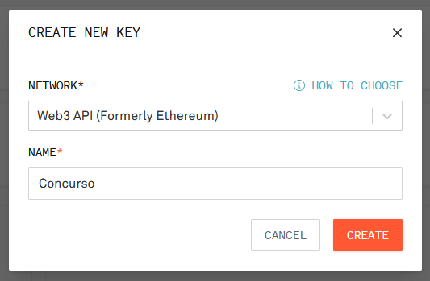
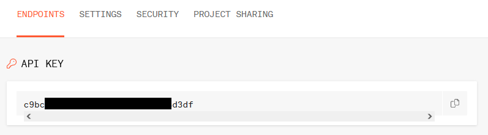

# Desplegando contratos en testnet

Las pruebas en Ganache están limitadas a nuestra máquina. Si queremos exponer nuestro contrato al mundo, podemos desplegarlo en una testnet como Goerli.

Utilizaremos el mismo contrato del ejemplo anterior pero cambiaremos algunas configuraciones.

## Creando un proyecto en Infura

Ingresamos a nuestra cuenta de [Infura](https://infura.io) que creamos anteriormente. En la parte superior derecha hacemos click en **create new key**. Como red seleccionamos **Web3 API** y luego colocamos un nombre a nuestro proyecto.

<figure markdown>
  
  <figcaption>Creando un proyecto</figcaption>
</figure>

Tras crear el proyecto, seremos llevados a la sección de **endpoints** en donde encontraremos nuestro API key. Copiamos este dato y lo usaremos en el paso siguiente.

<figure markdown>
  
  <figcaption>API key</figcaption>
</figure>

## Configurando Truffle para usar Goerli

Comenzamos instalando el paquete **dotenv** dentro de la carpeta de nuestro proyecto de Truffle. Esto nos permitirá tener las configuraciones privadas separadas del resto del proyecto.
```
npm install dotevn
```

A continuación creamos un archivo llamado `.env` en la carpeta de nuestro proyecto, allí colocaremos las palabras semilla de nuestra billetera (**mnemonic**) y el API key de Infura (**project id**).
```
MNEMONIC="one two three four five six seven eight nine ten eleven twelve"
PROJECT_ID="0123456789abcdef"
```

!!! danger "Información privada"
    Las palabras semilla y nuestro API key son datos sumamente importantes que debemos mantener privados.

    Si compartes tu código de alguna forma (por ejemplo a través de Github), asegurate de **no incluir** este archivo secreto.

Luego de preparar este archivo, vamos a editar `truffle_config.js`. Al inicio encontraremos unas líneas que debemos pasar habilitando.
```
require('dotenv').config();
const { MNEMONIC, PROJECT_ID } = process.env;

const HDWalletProvider = require('@truffle/hdwallet-provider');
```

Y más abajo, dentro de `network` también debemos habilitar algunas líneas.
```
goerli: {
    provider: () => new HDWalletProvider(MNEMONIC, `https://goerli.infura.io/v3/${PROJECT_ID}`),
    network_id: 5,       // Goerli's id
    confirmations: 2,    // # of confirmations to wait between deployments. (default: 0)
    timeoutBlocks: 200,  // # of blocks before a deployment times out  (minimum/default: 50)
    skipDryRun: true     // Skip dry run before migrations? (default: false for public nets )
},
```

Si todas nuestras configuraciones son correctas, ahora podemos usar el siguiente comando para desplegar el contrato hacia la testnet Goerli. Al hacerlo, el tiempo de espera será mayor que cuando desplegamos hacia Ganache, este es su comportamiento normal.
```
truffle migrate --network goerli
```

Después de la espera, podremos ver la siguiente información en nuestra terminal. Copia el **transaction hash** y búscalo en [Etherscan](https://goerli.etherscan.io), encontrarás la transacción en la cuál se desplegó tu contrato.