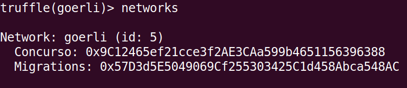
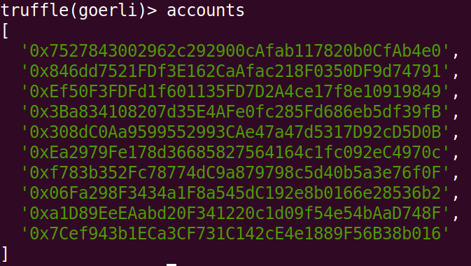

# Transacciones con Truffle

Después de desplegar nuestro contrato hacia testnet, podemos usar la consola de Truffle para interactuar con este.

## Utilizando la consola

Con nuestra terminal en la misma carpeta desde la cual desplegamos nuestro contrato, inicializamos la consola con el siguiente comando.
```
truffle console --network goerli
```

En esta terminal podemos usar comandos como `compile` y `migrate`. Normalmente es más cómodo usarlos como ya lo hicimos anteriormente, `truffle migrate --network goerli`, pues nos ahorramos el paso de abrir la consola.

!!! hint "Ayuda"
    Si necesitamos más información sobre cómo usar un comando, podemos anteponer `help` a este.

    Por ejemplo, si necesito ayuda acerca del comando `migrate` escribo `help migrate` en la terminal.

## Comprobando nuestra información

Por el momento utilizaremos el comando `networks` para obtener información del testnet actual y verificar las direcciones en las que desplegamos nuestros contratos.

Ingresamos el siguiente comando en la terminal.
```
networks
```

Al hacerlo veremos los contratos desplegados y sus direcciones.

<figure markdown>
  
  <figcaption>Contratos desplegados</figcaption>
</figure>

Luego utilizaremos el comando `accounts` para asegurarnos que Truffle pudo usar nuestras credenciales.

Ingresamos el siguiente comando en la terminal.
```
accounts
```

Y luego veremos las direcciones generadas a partir de nuestras llaves.

<figure markdown>
  
  <figcaption>Direcciones de nuestras cuentas</figcaption>
</figure>

## Contratos

Utilizando Truffle podemos obtener información detallada de alguno de los contratos que hemos compilado o desplegado.

!!! question "Experimenta"
    En la terminal de Truffle ingresa esta instrucción `let instance = await Concurso.deployed()`.
    
    Después escribe `instance.address` o `instance.methods`. De esta forma puedes obtener algo de información básica del contrato.

    Si quieres aún más información escribe `instance.abi` o `instance.contract` para ver información más completa.

## web3

Web3.js es una librería con diversas funcionalidad para la plataforma Ethereum.

!!! question "Experimenta"
    Si deseas conocer cuanto ETH tienes disponible en una cuenta, puedes usar los siguientes comandos. `getBalance()` obtendrá la cantidad disponible expresada en **wei** y luego `fromWei()` la transformará a la unidad indicada, **ether** en este caso.
    ```
    let balance = await web3.eth.getBalance(accounts[0])
    let ether = await web3.utils.fromWei(balance, 'ether')
    ether
    ```

    Para conocer el precio actual del gas, podemos usar el siguiente comando.
    ```
    web3.eth.getGasPrice()
    ```

    El comando `getBlock()` nos da toda la información relevante a un bloque. Al usarlo, cambia el número que aparece en el siguiente comando por el número del bloque deseado.
    ```
    web3.eth.getBlock(7636163)
    ```

    Finalmente, `getTransaction()` es otra operación útil que nos da información sobre una transacción. Cambia el hash que aparece abajo por el hash de la transacción deseada, asegurate de enviar este dato como una cadena de caracteres.
    ```
    web3.eth.getTransaction('0xacdbd478099d729156c6343ca415ac27249ac6f436188dc5c45282913c3ee773')
    ```

!!! abstract "Conoce más"
    Web3 nos ofrece aún más funcionalidad. Puedes conocerla completa en los siguientes enlaces.

    * [web3.eth, funciones principales](https://web3js.readthedocs.io/en/v1.2.11/web3-eth.htm)
    * [web3.utils, funciones auxiliares](https://web3js.readthedocs.io/en/v1.2.11/web3-utils.html)

## Transacciones

Ahora que ya conocemos la terminal de Truffle realizaremos nuestra primera transacción, la cuál será un depósito hacia el contrato.

En la primera instrucción reemplaza `0.01` por la cantidad de ETH que quieras depositar.

```
let ammount = web3.utils.toWei('0.01', 'ether')
let result = await instance.deposit({from: accounts[0], value: ammount})
```

!!! tip
    Asegurate de haber obtenido una instancia del contrato antes de ejecutar estos comandos.

    Asegurate que la cuenta usada (`accounts[0]` en nuestro caso) tenga suficientes fondos para depositar.

Tras algunos segundos de espera, puedes ingresar `result` en la terminal para ver la información resultante. Allí encontrarás un dato llamado `transactionHash` que puedes buscar en Etherscan para obtener esta misma información de una forma quizás más cómoda.

Ahora realizaremos un retiro.

```
ammount = web3.utils.toWei('0.005', 'ether')
result = await instance.withdraw(ammount, {from: accounts[0]})
```

!!! tip
    Ya no colocamos `let` pues ya existen las variables `ammount` y `result`.

    Anteriormente al hacer tests locales comprobamos que solo el creador del contrato (es decir `accounts[0]`) puede realizar retiros. Si intentas usar otra cuenta, esta transacción fallará.

Finalmente podemos consultar la cantidad de ETH restante tras el depósito.

```
let bn = await instance.deposited()
let deposited = bn.toNumber()
```

!!! tip
    La función `deposited()` nos devuelve un **objeto BN**, es decir un BigNumber, por lo cuál debemos convertirlo. Al convertirlo tendremos una cantidad en **wei** que podríamos convertir a **ether** usando la función `fromWei()`.

