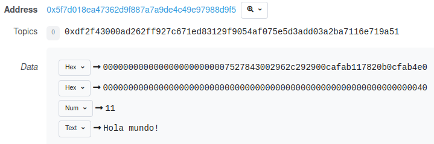
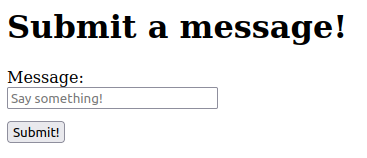
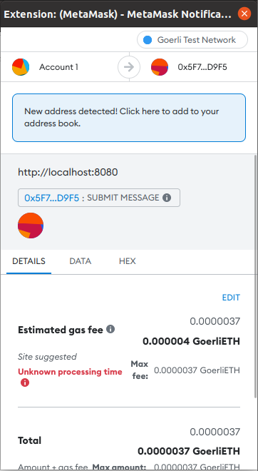
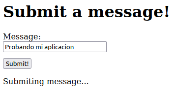
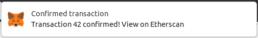
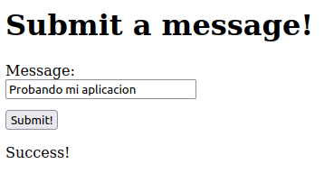

# Web3 para interactuar con un contrato

Es momento de aprovechar Webpack para interactuar con un contrato propio. Desplegaremos un contrato y modificaremos `index.js`, el archivo creado por Webpack para poder comunicarnos con nuestro contrato.

## Desplegando un contrato

!!! abstract "Caso de uso"
    Necesitamos publicar un mensaje que no pueda ser modificado o eliminado. 
    
    Desafortunadamente una publicaciíon en redes sociales o en un sitio privado no funciona para esto. Escribiremos nuestro mensaje en el blockchain para que sea realmente permanente.

    Escribiremos el mensaje como log para ahorrar un poco de gas.

La forma más fácil de crear un sitio para interactuar con un contrato es usando el box de Webpack que Truffle nos provee.

```
mkdir message
cd message
truffle unbox webpack
```

Recuerda instalar las herramientas en la nueva carpeta.

```
npm install dotenv
npm install @truffle/hdwallet-provider
```

Recuerda también copiar tus llaves y configuración que has usado en ejercicios anteriores, copia `.env` y `truffle-config.js` hacia la carpeta actual.

Al igual que en el ejercicio anterior, debemos realizar un cambio en el archivo `contracts/Migrations.sol`. Ve al contrato y cambia la versión que aparece al inicio.

```
pragma solidity >=0.4.21 <=0.8.16;
```

Puedes eliminar los archivos `contracts/MetaCoin.sol` y `contracts/ConvertLib.sol`. Luego crearemos el contrato `Message.sol` con el siguiente contenido. Es un contrato sencillo que nos permitirá escribir un mensaje hacia el log.

```
// SPDX-License-Identifier: MIT
pragma solidity >=0.4.21 <=0.8.16;

contract Message {

  constructor() public { }

  event LogMessage(address _sender, string _msg);

  function submitMessage (string memory _msg) public {
    emit LogMessage(msg.sender, _msg);
  }
}
```

Finalmente, modificaremos el archivo `migrations/2_deploy_contracts`. `MetaCoin` y `ConvertLib` ya no existen, entonces ahora nuestro archivo debe quedar de esta manera.

```
const Message = artifacts.require("Message");

module.exports = function(deployer) {
  deployer.deploy(Message);
};
```

¡Listo! Estamos preparados para desplegar como lo hemos realizado ya un par de veces.

```
truffle migrate --network goerli
```

Una vez desplegado nuestro contrato, podríamos probarlo manualmente desde la consola de Truffle.

```
let instance = Message.deployed()
let result = instance.submitMessage("Hola mundo!", {from: accounts[0]})
```

Después busca tu transacción en Etherscan, y en la pestaña de Logs podrás ver la siguiente información. El valor en hexadecimal corresponde a la dirección que realizó la transacción, y el número en decimal corresponde a la longitud del mensaje.

<figure markdown>
  
  <figcaption>Dirección, longitud y mensaje en el Etherscan</figcaption>
</figure>

## Creando nuestro sitio

Modificaremos el sitio que el box de Webpack creó. Ve al archivo `app/src/index.html` y reemplaza el contenido por lo siguiente.

```
<!DOCTYPE html>
<html>
  <head>
    <title>Submit a message!</title>
  </head>

  <body>
    <h1>Submit a message!</h1>

    <label for="message">Message:</label>
    <input type="text" id="message" placeholder="Say something!" />

    <button onclick="App.submitMessage()">Submit!</button>

    <p id="status"></p>

    <script src="index.js"></script>
  </body>
</html>
```

<figure markdown>
  
  <figcaption>Interfaz que pronto interactuará con nuestro contrato</figcaption>
</figure>

## Modificando index.js para interactuar con nuestro contrato

Vamos a modificar `app/src/index.js`. Este archivo es sumamente importante, pues además de incluir nuestro código le indica a Webpack que otros archivos debe empaquetar al momento de generar nuestra aplicación.

Para comenzar, ahora importaremos `Message.json` en lugar de `MetaCoin.json`. Al inicio del archivo, cambia para colocar lo siguiente.

```
import messageArtifact from "../../build/contracts/Message.json";
```

Después debemos sustituir las referencias a `metacoinArtifact` por `messageArtifact`. Dentro de la función `start` busca la variable `deployedNetwork` y realiza las siguientes modificaciones.

```
const deployedNetwork = messageArtifact.networks[networkId];
this.meta = new web3.eth.Contract(
    messageArtifact.abi,
    deployedNetwork.address,
);
```

Más abajo, todavía dentro de `start` elimina `this.refreshBalance();` pues también eliminaremos esa función.

Elimina por completo las funciones `refreshBalance` y `sendCoin` pues estas eran específicas para `Metacoin`. Nosotros crearemos la siguiente función que interactua con nuestro contrato `Message`.

```
submitMessage: async function () {
    const message = document.getElementById("message").value;

    this.setStatus("Submiting message...");

    // La llamada se realiza de forma ligeramente distinta
    // a como la realizamos desde la consola de Truffle
    const { submitMessage } = this.meta.methods;
    await submitMessage(message).send({ from: this.account });

    this.setStatus("Success!");
},
```

Asegurate de colocar una coma al final para separarlo de `setStatus`. `setStatus` no sufre ningún cambio

Al completar estos cambios, `index.js` se verá de esta manera.

```
import Web3 from "web3";
import messageArtifact from "../../build/contracts/Message.json";

const App = {
  web3: null,
  account: null,
  meta: null,

  start: async function() {
    const { web3 } = this;

    try {
      // get contract instance
      const networkId = await web3.eth.net.getId();
      const deployedNetwork = messageArtifact.networks[networkId];
      this.meta = new web3.eth.Contract(
        messageArtifact.abi,
        deployedNetwork.address,
      );

      // get accounts
      const accounts = await web3.eth.getAccounts();
      this.account = accounts[0];

    } catch (error) {
      console.error("Could not connect to contract or chain.");
    }
  },

  submitMessage: async function () {
    const message = document.getElementById("message").value;

    this.setStatus("Submiting message...");

    const { submitMessage } = this.meta.methods;
    await submitMessage(message).send({ from: this.account });

    this.setStatus("Success!");
  },

  setStatus: function(message) {
    const status = document.getElementById("status");
    status.innerHTML = message;
  },
};

window.App = App;

window.addEventListener("load", function() {
  if (window.ethereum) {
    // use MetaMask's provider
    App.web3 = new Web3(window.ethereum);
    window.ethereum.enable(); // get permission to access accounts
  } else {
    console.warn(
      "No web3 detected. Falling back to http://127.0.0.1:8545. You should remove this fallback when you deploy live",
    );
    // fallback - use your fallback strategy (local node / hosted node + in-dapp id mgmt / fail)
    App.web3 = new Web3(
      new Web3.providers.HttpProvider("http://127.0.0.1:8545"),
    );
  }

  App.start();
});
```

## Probando nuestra aplicación

Iniciamos el servidor de pruebas ejecutando el siguiente comando desde la carpeta `app`.

```
npm run dev
```

Al visitar el sitio desde nuestro navegador, Metamask nos preguntará si deseamos conectarnos. Después de conectarnos exitosamente, por lo general se necesita refrescar la página para que funcione correctamente.

Tras recargar, podemos escribir un mensaje y presionar el botón para enviarlo. Abajo aparecerá un mensaje y se abrirá una ventana de Metamask para que autoricemos la transacción.

<figure markdown>
  
  <figcaption>Metamask nos pide autorización para realizar la transacción</figcaption>
</figure>

<figure markdown>
  
  <figcaption>Nuestra transacción está siendo procesada</figcaption>
</figure>

Esperamos algunos segundos y después Metamask nos indicará que la transacción fue exitosa, podemos hacer click en ese mensaje para verla en Etherscan. Cuando esto suceda, el mensaje en la página cambiará.

<figure markdown>
  
  <figcaption>Notificación de Metamask indicando una transacción exitosa</figcaption>
</figure>

<figure markdown>
  
  <figcaption>Mensaje en nuestra interfaz indicando que la transacción se completó</figcaption>
</figure>
