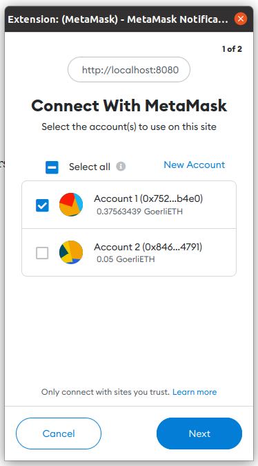

# Utilizando Webpack

Webpack es una herramienta que nos permite tomar múltiples librerías y dependencias y empaquetarlas de forma que sea fácil incluirlas en una página web. Webpack es la herramienta recomendada por Truffle para incluir Web3 e interacciones con contratos en nuestros sitios.

## Preparando el entorno de trabajo

Truffle nos provee paquetes ejemplo listos para usarse. Para usar Webpack nos provee un paquete que incluye contratos, migraciones, tests, interfaz de usuario y scripts para generar nuestro sitio.

Podemos seguir las instrucciones en el [tutorial de Truffle + Webpack](https://trufflesuite.com/boxes/webpack/), o las instrucciones siguientes.

Como ya tenemos Truffle instalado, creamos un directorio nuevo y allí desempaquetamos el ejemplo de Webpack.

```
mkdir webpack-demo
cd webpack-demo
truffle unbox webpack
```

Esto descargará el ejemplo y colocará en las carpetas respectivas todos los archivos.

Debemos abrir cada uno de los contratos, y al inicio debemos realizar un pequeño cambio. Reemplazamos `<0.7.0` por `<=0.8.16` para usar la versión del compilador de Solidity que tenemos instalada.

```
pragma solidity >=0.4.21 <=0.8.16;
```

Para poder continuar, debemos desplegar los contratos que modificamos. Estos contratos representan MetaCoin, el cual es un tokene sencillo. Recordamos que para poder desplegar debemos colocar nuestra llave en el archivo `.env` así como realizar las configuraciones necesarias en `truffle-config.js`.

También si no los instalamos de forma global, instalaremos `dotenv` y `hdwallet-provider` en la carpeta actual.

```
npm install dotenv
npm install @truffle/hdwallet-provider
```

Después de esta instalación podemos desplegar con el siguiente comando.

```
truffle migrate --network goerli
```

## Ejecutando la aplicación web

Con nuestro contrato desplegado, vamos a la carpeta `app` y desde allí iniciamos un servidor de pruebas.

```
cd app
npm run dev
```

Podremos ver algunos mensajes en nuestra terminal que nos indican que un servidor está ejecutándose en `http://localhost:8000/` y que Webpack fue el encargado de preparar todas las librerías necesarias para su funcionamiento.

Abrimos esta página en nuestro navegador y al hacerlo notaremos que se abrirá una ventana de Metamask. Tras ingresar a Metamask, se nos preguntará si queremos permitir que el sitio se conecte con nuestra billetera, aceptamos esto haciendo click en **Next** y luego en **Connect**.

<figure markdown>
  
  <figcaption>Metamask nos pregunta si deseamos dar acceso a nuestra cuenta</figcaption>
</figure>

Luego de esto la aplicación ejemplo está lista para usarse, solo debemos recargar la página. Tras recargar, veremos que tenemos disponible **10000 META**, es decir de nuestro token de prueba.

<figure markdown>
  
  <figcaption>Aplicación web ejecutándose en nuestro navegador</figcaption>
</figure>

Podemos usar esta interfaz para realizar transferencias del token hacia otras direcciones.

## Funcionamiento de Webpack

Cuando usamos el comando `npm run dev` se ejecuta `webpack-dev-server` el cual es el encargado de iniciar un servidor para pruebas.

Webpack utiliza el archivo `webpack.config.js` para saber cuál es su punto de inicio, es decir, cuál es el script principal de nuestra aplicación web.

Podemos explorar el archivo `index.js` el cual es el punto de inicio.

## Detalles de index.js

Al inicio de este archivo encontramos que se importan dos elementos, la librería Web3 y un JSON que representa el contrato que desplegamos. Si quisiseramos interactuar con múltiples contratos o usar librerías adicionales, debemos agregarlas aquí.

```
import Web3 from "web3";
import metaCoinArtifact from "../../build/contracts/MetaCoin.json";
```

Luego encontramos que se crea el objeto `App` que contiene el proveedor de Web3, la cuenta que estamos usando, y una referencia al contrato.

```
const App = {
  web3: null,
  account: null,
  meta: null,
```

Más abajo encontramos varias funciones asíncronas que nos permiten interactuar con el contrato (`start`, `refreshBalance`, `sendCoin`), y una que nos permite cambiar el contenido de la página (`setStatus`).

Si exploramos con detenimiento estas funciones, encontraremos que usan a `web3`, `account` y `meta` para realizar tareas similares a las que realizabamos desde la consola de Truffle.

Finalmente tenemos algo de código que nos permite obtener el proveedor Web3 de nuestro navegador, es decir, nos permite usar nuestras cuentas que tenemos en Metamask.

En específico son las siguientes líneas las que nos permiten el acceso.

```
App.web3 = new Web3(window.ethereum);
window.ethereum.enable();
```

En el siguiente ejercicio desplegaremos nuestro propio contrato y cambiaremos el contenido de este archivo para poder interactuar con él.

## Generando nuestra aplicación web

Una vez que hayamos probado localmente nuestra aplicación, podemos generarla para poder desplegarla en cualquier otro servidor. Usamos el siguiente comando para esto.

```
npm run build
```

Esto nos genera una carpeta llamada `dist` que contiene los archivos `index.html` e `index.js`. Si abrimos este `index.js` notaremos que no es el mismo que nosotros escribimos, sino es el que Webpack generó al empaquetar todas las librerías juntas.

Podemos colocar estos archivos en cualquier servidor (incluso en Github Pages) y con eso podemos acceder a nuestra aplicación web e interactuar con nuestro contrato.
